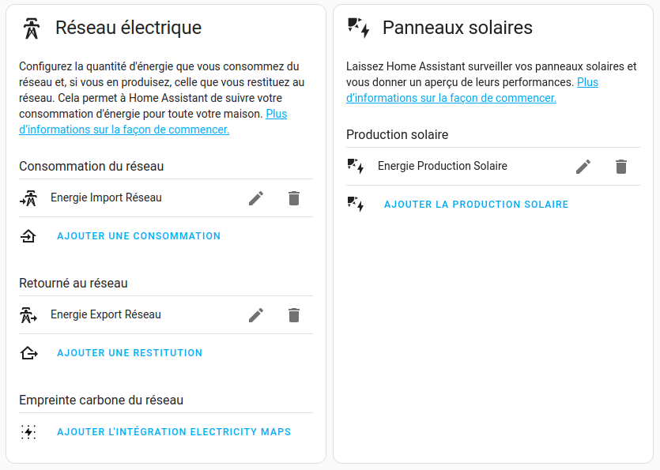
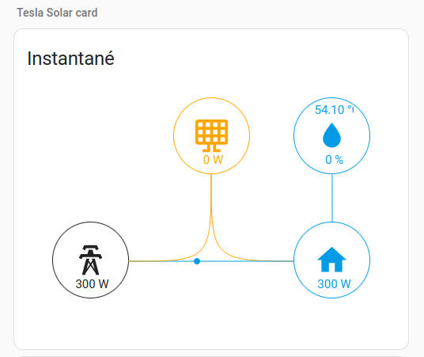
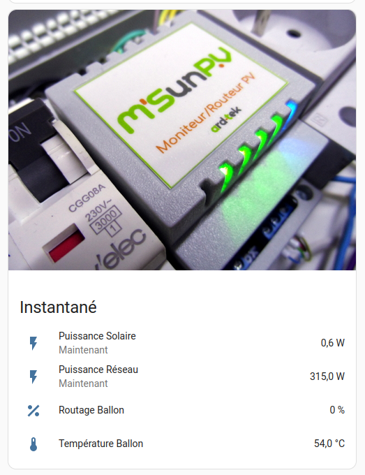
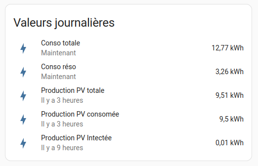
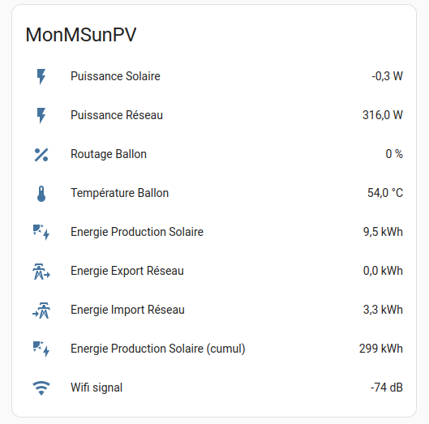

# Documentation de l'intégration MSunPV pour Home Assistant

## Description des entités

| Clé     | Nom         | Unité | Description        |
|:--------|:------------|:-----:|:-------------------|
| powreso | Puissance Réseau |kW| Puissance instantanée consommée sur le réseau (positif si conso, négatif si injection)|
| powpv | Puissance Solaire | kW | Puissance instantanée produite par les panneaus solaires (positif)|
| outbal | Routage Ballon | % | Taux de routage vers le ballon |
| outrad | Routage Radiateur | % | Taux de routage vers le radiateur |
| tbal | Température ballon | °C | Température du ballon (si sonde)|
| tsdb | Température Salle de bain | °C | Température de la salle de bain (si sonde) |
| tamb | Température ambiante | °C | Température ambiante (si sonde) |
| consommation_jour | Energie Import Réseau | kWh | Energie journalière importée du réseau |
| injection_jour | Energie Export Réseau | kWh | Energie journalière exportée (injectée) |
| production_jour | Energie Production Solaire | kWh | Production solaire journalière |
| production_cumul | Energie Production Solaire (cumul) | kWh | Production solaire cumulée |
| production_jour_cons | Energie Production Solaire Consommée | kWh | Production solaire consommée (PV - Inj) |
| consommation_globale | Energie Consommation globale | kWh | Consommation globale habitation (reseau + PV - Inj) |
| powpv_inj | Puissance Solaire injectée | kW | Puissance Solaire injectée (P inj si >0) |
| powpv_cons | Puissance Solaire consommée | kW | Puissance Solaire consomée (powpv - powpv_inj) |
| rssi | Wifi signal | dB | Niveau de réception du signal WiFi |
| modele | Modèle du routeur | -- | Modèle du routeur |

## Configuration du Dashboard Energie
Pour fonctionner, le **Dashboard Energie** a besoin d'être configuré. Les données fournie par le **MSunPV** peuvent être utilisées pour l'alimenter.
| Paramètre          | Entité                    |
|:-------------------|:--------------------------|
| Consommation du réseau | Energie Import Réseau |
| Retourné au réseau | Energie Export Réseau |
| Production solaire | Energie Production Solaire |

Exemple:

## Propositions d'affichages

Vous pouvez utiliser la carte d'affichage [Tesla solar card](https://github.com/reptilex/tesla-style-solar-power-card), pour une représentation graphique des puissances instantanées (production, consommation/injection réseau, consommation maison, temperature ballon).

Cette carte est disponible dans **HACS** sous le nom : **tesla-style-solar-power-card**

Exemples de cartes:

  

